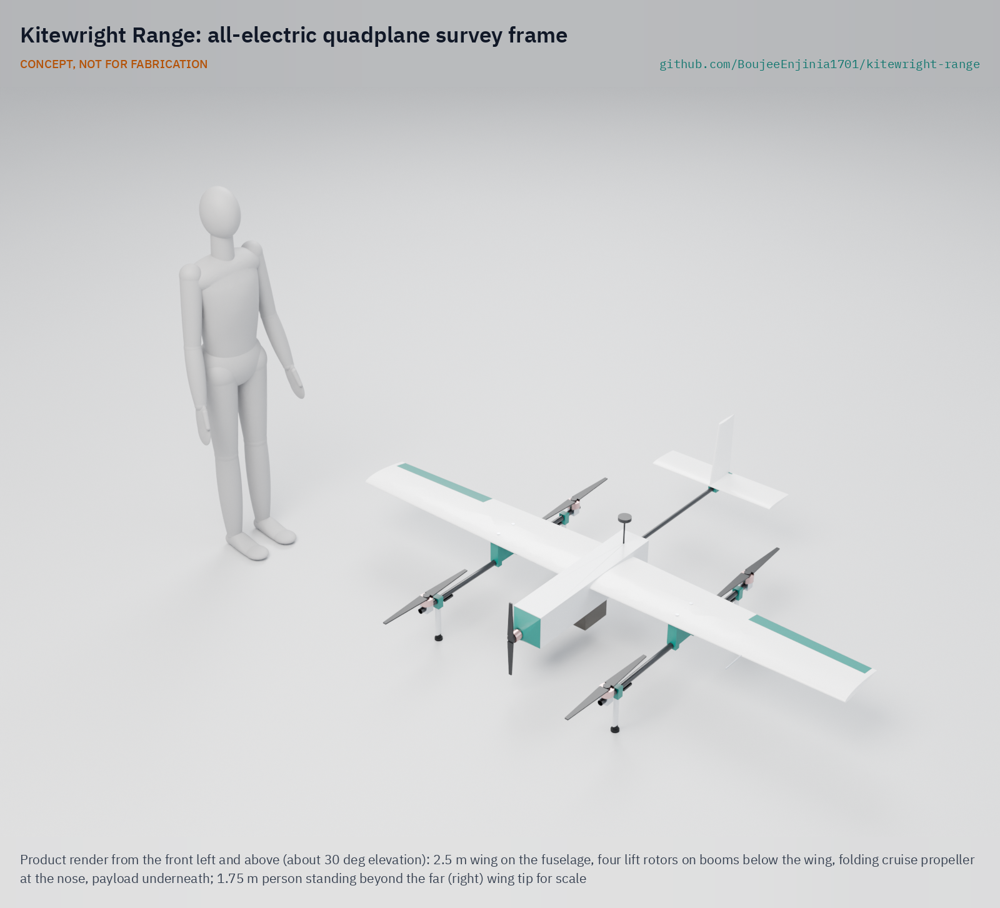
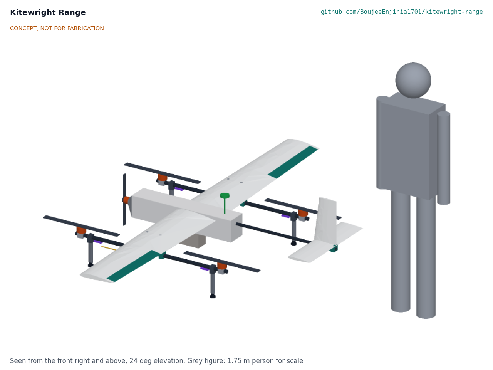

# Kitewright Range

     

**Area:** Aerial robotics · **TRL:** 3 of 9 (proof of concept on paper; design constructable) · **Value-engineering target:** USD 5,000; estimated cost USD 4,314 (USD 686 under) · **Difficulty:** 4 of 5

An all-electric quadplane frame for the Kitewright family that takes off vertically and cruises on a fixed wing for long surveys.

[Problem](docs/01-problem.md) · [Precis](docs/02-concept.md) · [Requirements](docs/03-requirements.md) · [Calculations](docs/04-calcs/01-sizing.md) · [Prototype build plan](docs/05-build-plan.md) · [Design decisions](docs/06-design-decisions.md) · [General arrangement](cad/drawings/KWR-DWG-001.png) · [3D viewer](media/viewer.html)

CONCEPT, NOT FOR FABRICATION. On paper (KWR-CAL-001): 2.5 m span, 11.1 kg with a 1 kg payload, 52 % hover thrust margin at 5,000 m, and 33 min and 44 km on the wing with a 20 % reserve. Endurance and take-off mass miss their targets; Amish accepted both for the first prototype.

## Concept rationale

Kitewright Range is the long-reach frame of the Kitewright civilian drone family. It is an all-electric quadplane: four fixed lift rotors on two booms for vertical take-off and landing, a single fixed wing for cruise, and one electric cruise motor. It is not a tail-sitter and it has no tilting motors. It takes off from a moraine ridge or a lakeside camp, climbs, then flies on the wing, which needs far less power than hovering, so one battery covers a whole lake or snow basin.

It carries the Kitewright Core: an open PX4 or ArduPilot autopilot, the ColdCell power bus and the family's single payload mount (Pixhawk DS-014 style connector on a plain rail with a locking pin). Any Kitewright payload, including LakeWatch, fits without rework. Keeping the frame open and buildable means a state disaster agency, a university glaciology group or a mountain NGO can build, repair and adapt it, rather than wait for a vendor to support its altitude and climate.

## Burning platform

About 15 million people worldwide live in the path of potential glacial lake outburst floods, and 62% of them are in High Mountain Asia; since 1990 the number of glacial lakes has grown by 53% and their volume by 48% ([Taylor et al., Nature Communications, 2023](https://www.nature.com/articles/s41467-023-36033-x)). India has identified 189 high-risk glacial lakes out of about 7,500 in its Himalaya, but field teams can reach them only from June to September because they sit above 4,500 m, and only 15 had been visited when the national programme was approved ([ThePrint, 2024](https://theprint.in/india/govt-approves-rs-150-crore-for-glacial-lake-outburst-flood-risk-mitigation-programme-for-4-states/2232525/)).

Fixed-wing VTOL drones already do this kind of survey, but at a price and within limits that do not suit these users. The Quantum Systems Trinity Pro lists a 5,500 m service ceiling and a lowest operating temperature of -12 C ([Quantum Systems](https://quantum-systems.com/trinity-pro/)) and sells for about USD 23,790 ([Drone Nerds](https://www.dronenerds.com/products/quantum-systems-trinity-pro-americas)). Many Himalayan lakes lie at or above that ceiling, and air at 5,000 m in the standard atmosphere is already at -17.5 C with a density of 0.736 kg/m3, 60% of sea level ([Engineering ToolBox, US Standard Atmosphere](https://www.engineeringtoolbox.com/standard-atmosphere-d_604.html)). An open design lets users tune wing, rotors and batteries to their own altitude instead of accepting a vendor's envelope.

## Where it could be used

### By industry

| Industry | Use |
| --- | --- |
| Disaster risk management | Repeat surveys of high-risk glacial lakes and their moraine dams for state and national disaster agencies (with the LakeWatch payload) |
| Glaciology and climate research | Mapping of glacier snouts, lake area and snow cover over whole basins in one flight |
| Hydropower | Upstream hazard checks on lakes and valleys above run-of-river plants |
| Mountain search and rescue | Wide-area first sweep of a valley or glacier before a multirotor narrows the search |
| Water resources | Snowpack and melt surveys that feed seasonal water supply forecasts |

### By country or region

| Country or region | Why it matters there |
| --- | --- |
| India (Sikkim, Himachal Pradesh, Uttarakhand, Arunachal Pradesh) | The national programme covers 189 high-risk lakes, reachable on foot only from June to September above 4,500 m ([ThePrint, 2024](https://theprint.in/india/govt-approves-rs-150-crore-for-glacial-lake-outburst-flood-risk-mitigation-programme-for-4-states/2232525/)). |
| India (Kashmir Himalaya) | A 2026 inventory found 155 glacial lakes, five with very high outburst susceptibility threatening several thousand buildings, 15 major bridges and a hydropower project ([Journal of Glaciology, 2026](https://www.cambridge.org/core/journals/journal-of-glaciology/article/glacial-lake-outburst-flood-susceptibility-and-potential-downstream-implications-across-the-kashmir-himalaya/501837D9ABC0A452DD68841F1225D78D)). |
| Pakistan (Gilgit-Baltistan and Khyber Pakhtunkhwa) | The UNDP GLOF-II project works across 24 valleys in 15 districts and serves more than 605,000 people ([UNDP](https://www.undp.org/pakistan/projects/scaling-glacial-lake-outburst-floods-risk-reduction-northern-pakistan-glof-ii-project)). |
| Nepal | The August 2024 Thame flood came from two lakes that do not appear to have been formally monitored beforehand ([Wikipedia, 2024 Thame flood](https://en.wikipedia.org/wiki/2024_Thame_flood)). |
| Peru (Cordillera Blanca) | Lake Palcacocha, whose 1941 outburst killed at least 1,600 people in Huaraz, had grown to 17.4 million m3 by 2016 and is still considered hazardous ([HESS, 2020](https://hess.copernicus.org/articles/24/93/2020/)). |

## What sparked the idea

In July 2018 the climber Rick Allen fell from an ice cliff while descending Broad Peak in the Karakoram and was missing for 36 hours. Bartek Bargiel, filming his brother's ski descent of K2, flew his drone over the slope, found Allen alive at about 7,500 m and guided a rescue team to him ([Explorersweb, 2018](https://explorersweb.com/rick-allen-found-alive-on-broad-peak/)). That flight showed what a small drone can do in the high mountains. It also showed the limit: a consumer multirotor has minutes of air time at that height. Kitewright Range asks what an open, long-reach frame could do for the same mountains, starting with the glacial lakes that threaten the valleys below.

## Problem

Surveys of glacial lakes and snowpack in the high Himalaya need a drone that takes off from rough ground and still covers many kilometres in thin, cold air. Commercial fixed-wing VTOL drones that can do this are closed and cost more than most mountain agencies and research groups can field.

Full problem statement: [docs/01-problem.md](docs/01-problem.md)

## Concept

An all-electric quadplane frame for the Kitewright family (separate fixed lift rotors, single fixed wing, electric cruise motor, not a tail-sitter) that takes off vertically and cruises for long survey flights such as glacial lakes and snowpack.

Full design precis: [docs/02-concept.md](docs/02-concept.md) · Requirements: [docs/03-requirements.md](docs/03-requirements.md)

## Key components

- Two-piece foam and glass wing, 2.5 m span, on a carbon joiner through a lite-ply fuselage
- Four fixed 22 in lift rotors on carbon booms, hung on printed pylons below the wing
- Tractor cruise motor with a folding propeller at the nose; conventional tail on a carbon boom
- Kitewright Core hung under the fuselage at the centre of gravity; two 6S Li-ion packs (648 Wh) with AS150 leads
- Four faired landing legs; heated pitot

## Building the prototype

The prototype is built from hot-wire cut foam skinned in glass, lite-ply, carbon tube and printed ASA parts, with bought motors, propellers and the Kitewright Core avionics. The build plan takes a capable model builder through thirteen made components and sixteen assembly steps, each with a picture. Powered work stops at five safety stops, and the lift propellers go on only once the aircraft is tied down inside a keep-out zone. It is a plan, not yet built; building to it is TRL 4 work.

## Safety

> Published as an open engineering reference, not certified aviation equipment.
>
> Civilian use only. Certification under FAA Part 107, EASA rules or India's Drone Rules 2021 is out of scope at this TRL and will be addressed if prototypes progress.
>
> Spinning lift and cruise propellers can cause serious injury; arming, pre-flight and keep-out procedures must be written before any powered test.
>
> Lithium battery packs carry fire risk, especially after a crash or cold charging; charge only between 0 and 45 °C pack temperature in a fire-resistant box, and follow ColdCell safety rules.
>
> Lift propellers are fitted only at the build plan's propeller safety stop; first hovers are tied down inside a 15 m keep-out zone with the arming plug and lockable arming switch in use.
>
> Loss of link or battery in thin air may cause a crash in remote terrain; failsafe return and landing behaviour must be set and tested.
>
> Fly only where local rules allow, away from people, aircraft and wildlife; high-altitude sites may lie in restricted border or protected areas.
>
> This design is published as an open engineering reference. It is not certified equipment.

## Repository layout

| Folder | Contents |
| --- | --- |
| `docs/` | Problem, concept, requirements, calculations and design decisions |
| `cad/src/` | build123d Python source, the source of truth for all geometry |
| `cad/step/`, `cad/stl/` | Exported models for FreeCAD, other CAD tools and printing |
| `cad/drawings/` | 2D sketches and dimensioned drawings |
| `bom/` | Bill of materials |
| `electronics/` | KiCad schematics and PCB layouts |
| `firmware/` | Microcontroller code |
| `media/` | Renders, perspectives and photos |
| `build-log/` | Dated prototyping notes |

## Documentation

Controlled documents follow the portfolio [documentation standard](.kit/STANDARDS.md). Each carries a document ID (KWR-PRC-001 for the precis), a version and a revision history. Branded PDFs are built with `python .kit/render.py` and attached to GitHub Releases when a document is tagged, for example `KWR-PRC-001/v1.0`.

## Credits

Designed by Amish Chadha at Design Molecule Labs. See [CONTRIBUTORS.md](CONTRIBUTORS.md) for roles. To cite this design, use [CITATION.cff](CITATION.cff) (GitHub shows it as "Cite this repository").

AI assistance (Claude) was used to accelerate prototype documentation and first-pass research. Design direction and all decisions are Amish Chadha's, recorded in this repository's decision records (`docs/decisions/`).

## Licenses

- **Hardware** (CAD, drawings, BOM, electronics): [CERN-OHL-S v2](LICENSE)
- **Software** (firmware, scripts, notebooks): [MIT](LICENSE-SOFTWARE)

A project of the [Design Molecule](https://designmolecule.com) lab.
